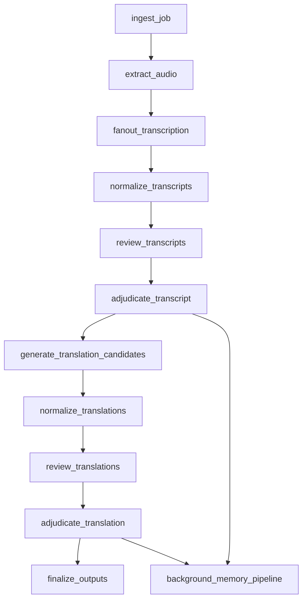

# Workflow

## End-To-End Graph

## Node Contracts

### `ingest_job`

Inputs:

- video path or URI
- target language
- project or tenant context

Outputs:

- `job_id`
- resolved language settings
- project profile ref
- initialized run state

Notes:

- this is where tenant and project defaults are resolved
- keep only lightweight refs in graph state

### `extract_audio`

Inputs:

- video reference
- run context

Outputs:

- `AudioArtifact`
- extraction metadata

Rules:

- use deterministic local tooling
- call `ffmpeg`
- fail terminally unless an alternate usable stream exists

### `fanout_transcription`

Inputs:

- audio artifact
- transcription request context

Outputs:

- raw transcript candidates from:
  - `AssemblyAI`
  - `Speechmatics`
  - `Deepgram`

Rules:

- run providers in parallel
- bounded retry on adapter failure
- partial success is acceptable if at least one valid candidate survives

### `normalize_transcripts`

Inputs:

- raw provider outputs

Outputs:

- canonical transcript candidates

Normalization must standardize:

- timestamps
- speaker labels
- whitespace
- provider metadata
- candidate IDs

### `review_transcripts`

Inputs:

- normalized transcript candidates
- scoped review context

Outputs:

- reviewer bundles from two reviewer agents

Reviewer roles:

- Reviewer A: literal accuracy, names, speaker fidelity, timestamps, terminology
- Reviewer B: omissions, additions, formatting, coherence, plausibility

### `adjudicate_transcript`

Inputs:

- transcript candidates
- parsed reviewer bundles
- adjudication context

Outputs:

- final transcript decision
- escalation metadata if needed
- memory candidate bundle

Routing policy:

- low disagreement: finalize
- medium disagreement: run conflict investigator, then re-adjudicate
- high disagreement: escalate to stronger adjudicator
- unresolved: mark for human review

### `generate_translation_candidates`

Inputs:

- final transcript
- translation request context

Outputs:

- candidate A from baseline prompt
- candidate B from contrasted prompt

Rules:

- both use `gpt-5.4-mini`
- prompt B must meaningfully differ in style or decision boundary
- retry failures per variant
- if one variant fails, continue with reduced confidence
- if both fail, preserve approved transcript and emit recoverable translation-failed state

### `normalize_translations`

Inputs:

- raw translation candidates

Outputs:

- canonical translation candidates

### `review_translations`

Inputs:

- final transcript
- translation candidates
- scoped translation review context

Outputs:

- reviewer bundles from two reviewer agents

Reviewer roles:

- Reviewer A: faithfulness, terminology, constraint preservation
- Reviewer B: fluency, tone, style fit, readability

### `adjudicate_translation`

Inputs:

- translation candidates
- parsed review bundles
- adjudication context

Outputs:

- final translation decision
- escalation metadata if needed
- memory candidate bundle

Policy mirrors transcript adjudication.

### `finalize_outputs`

Inputs:

- approved transcript decision
- approved translation decision or failure state
- scorecards
- artifact references

Outputs:

- persisted canonical transcript
- persisted canonical translation
- exported outputs
- trace refs
- downstream payloads

### `background_memory_pipeline`

Trigger points:

- after transcript adjudication
- after translation adjudication

Responsibilities:

- extract memory candidates
- consolidate and deduplicate
- write approved semantic and episodic memory
- propose translation prompt updates

## Reviewer Context Rules

Transcript reviewers receive:

- transcript candidates
- minimal project profile
- glossary slice
- transcription rules
- provider caveats
- small relevant episodic slice

Translation reviewers receive:

- final transcript
- translation candidates
- project profile
- glossary slice
- translation rules
- small relevant episodic slice

Conflict investigator receives:

- disputed spans only
- reviewer outputs
- adjudication context
- narrow memory slice

## Reviewer Output Shape

Reviewer output stays human-readable prose but must contain these sections:

- `Winner`
- `Confidence`
- `Why`
- `Key Errors By Candidate`
- `Quoted Evidence`
- `Suggested Fixes`
- `Escalate?`

A deterministic parser must extract:

- preferred candidate
- confidence
- evidence spans
- issue categories
- escalation signal

## Failure Policy

- `ffmpeg` failure is terminal unless an alternate usable stream exists.
- Adapter failures retry with bounded backoff.
- Single surviving transcript candidate is allowed but should bias adjudication toward escalation.
- Single surviving translation candidate is allowed but should reduce confidence.
- All escalations must preserve candidates, reviewer outputs, and recalled memory refs.
