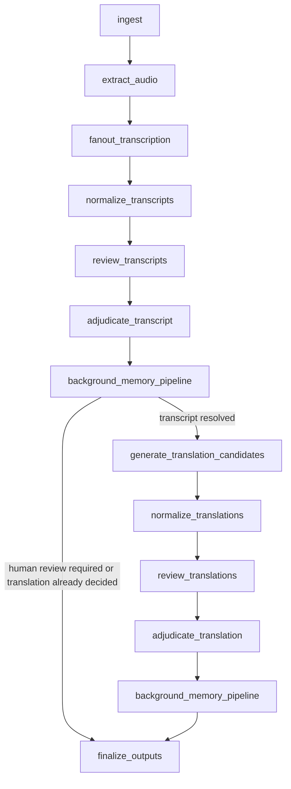

# Workflow

## Graph Topology

The current graph is wired in `src/translation_agent/graph/builder.py`.

After the graph finishes, `run_workflow()` performs a best-effort `drain_background_memory()` pass. That pass can consolidate staged batches, generate prompt-evolution proposals, and republish outputs so the final artifact manifest includes the new memory refs.

## Node Contracts

### `ingest`

Purpose:

- establish the request artifact ref in graph state
- append initial routing facts

Inputs:

- `run_id`
- `JobContext`
- source artifact ref

Outputs:

- `current_stage="ingest"`
- `source_artifact_ref`
- routing facts for job initialization and scenario

### `extract_audio`

Purpose:

- call the configured audio extractor
- write the audio blob if the extractor returns bytes
- persist canonical audio metadata

Outputs:

- audio blob ref
- audio metadata artifact
- routing fact describing the audio artifact

### `fanout_transcription`

Purpose:

- run all configured STT adapters in parallel
- persist raw payloads and staged transcript candidates
- tolerate partial provider failure

Success rule:

- at least one transcript candidate must survive

Failure rule:

- if all transcription providers fail, the run errors out

Routing facts:

- `transcription_provider_succeeded`
- `transcription_provider_failed`

### `normalize_transcripts`

Purpose:

- load staged transcript candidates
- normalize identifiers, segments, metadata, and full text
- persist normalized candidates to the decision store and blob store

Failure rule:

- if no candidates remain after normalization, the run errors out

### `review_transcripts`

Purpose:

- recall transcript-stage memory
- render deterministic reviewer prose for two reviewer roles
- parse that prose into canonical `ReviewBundle` models

Reviewer roles:

- `accuracy_reviewer`
- `coherence_reviewer`

Outputs:

- transcript review IDs
- persisted review-memory bundle

### `adjudicate_transcript`

Purpose:

- load normalized transcript candidates and parsed reviews
- recall a smaller adjudication memory slice
- score disagreement and produce a deterministic decision

Outputs:

- final transcript candidate ID
- transcript decision ref
- optional investigation ref
- `pending_memory_source_stage="transcript_adjudication"`
- escalation and human-review flags

Possible decision modes:

- `automatic_finalize`
- `conflict_investigation`
- `stronger_adjudicator`
- `human_review`

### `background_memory_pipeline`

Purpose:

- convert the most recent decision into a scoped `MemoryWriteBatch`
- persist the batch without blocking on consolidation

Behavior:

- after transcript adjudication, the router always continues into translation generation unless a
  translation decision already exists
- after translation adjudication, the next step is always finalization

### `generate_translation_candidates`

Purpose:

- load every surviving transcript candidate
- generate one translation candidate per transcript candidate and prompt variant
- persist raw payloads and staged translation candidates

Current prompt variants:

- `variant-a`
- `variant-b`

Behavior:

- single-variant survival is allowed
- if both variants fail, the node sets `translation_failed=True`
- candidate provenance remains explicit through `source_transcript_candidate_id`

### `normalize_translations`

Purpose:

- normalize translation candidate metadata, segment ordering, and full text
- persist normalized translation candidates

Outputs:

- zero or more normalized translation candidate IDs

### `review_translations`

Purpose:

- recall translation-stage memory
- include transcript provenance on every translation candidate
- render and parse deterministic reviewer output

Reviewer roles:

- `faithfulness_reviewer`
- `style_reviewer`

Behavior:

- if there are no translation candidates, the node emits `review_skipped`

### `adjudicate_translation`

Purpose:

- decide between surviving translation candidates or emit a recoverable failure state

Special cases:

- if there are no translation candidates, the node creates a `FinalTranslationDecision` with `human_review_required=True` and `translation_failed=True`
- a translation conflict investigation can time out and be converted into `human_review`
- human review is translation-only; approving a translation candidate implicitly selects its source
  transcript candidate
- normal disagreements with a surviving machine winner stay in machine adjudication and do not
  open routine human review

Outputs:

- final translation candidate ID or `None`
- final transcript candidate ID follows the winning translation when machine adjudication resolves
- translation decision ref
- optional investigation ref
- optional `pending_memory_source_stage="translation_adjudication"`
- translation failure and human-review flags

### `finalize_outputs`

Purpose:

- publish the current set of artifacts without waiting for memory consolidation

Outputs:

- published transcript when a transcript winner exists
- published translation when a translation winner exists and human review is not required
- approval-driven republish of transcript, translation, exports, and deliveries when a human
  publishes a flagged-span review decision
- recoverable translation failure manifest when translation generation failed
- scorecard
- exports
- downstream delivery payload
- published artifact manifest

## Routing Rules

The only conditional edge lives after `background_memory_pipeline`.

`route_after_memory_pipeline()` currently behaves like this:

- if `final_translation_decision_ref` exists, go to `finalize_outputs`
- else if `human_review_required` is `True`, go to `finalize_outputs`
- else go to `generate_translation_candidates`

Implications:

- transcript-stage disagreement no longer skips the translation path
- translation adjudication always leads to finalization

## Status Semantics

The API maps final graph state into these public statuses:

- `completed`
  The workflow reached finalization without human review and without transcription degradation.
- `completed_with_degraded_transcription`
  At least one transcription provider failed, but another candidate survived and the run completed.
- `completed_after_human_review`
  Translation review was reopened later, a human approved a translation candidate, and canonical
  transcript and translation artifacts were republished in place.
- `human_review_required`
  Translation adjudication produced candidates but still requires a later human approval step.
- `translation_failed`
  All translation variants failed, the transcript was preserved, and a recoverable translation failure artifact was published.

## Scenario-Driven Fake Runtime

Fake mode uses a `scenario` metadata field to drive deterministic branch coverage.

Implemented scenarios include:

- `happy`
- `degraded_stt`
- `single_transcript_candidate`
- `transcript_escalation`
- `translation_single_variant`
- `translation_failed`
- `translation_conflict`
- `translation_conflict_timeout`
- `translation_high_risk`
- `translation_escalation`

These scenarios are used heavily by the phase and regression tests to keep routing behavior reproducible.

## Published Outputs

A successful translation run publishes:

- `published/transcript.json`
- `published/translation.json`
- `published/scorecard.json`
- `published/artifacts.json`
- `exports/translation.srt`
- `exports/translation.json`
- `deliveries/translation.json`
- `traces/<run_id>.jsonl`
- memory batch, consolidation, and prompt-evolution refs when available

A human-approved review also publishes:

- `approvals/translation.json`
- `learning/transcript-approval.json`
- republished `published/transcript.json`
- republished `published/translation.json`
- republished exports and downstream delivery payloads

A translation-failed run publishes:

- `published/transcript.json`
- `translation-failed.json`
- `published/scorecard.json`
- exports and delivery payloads with the failure status

## Guarantees Exercised By Tests

The most important workflow guarantees are covered by tests:

- happy path end-to-end execution
- degraded transcription with partial provider failure
- single surviving translation variant
- translation failure with transcript preservation
- transcript disagreement that still continues into translation generation
- medium disagreement conflict investigation
- high-risk translation escalation
- timeout-to-human-review regression behavior
- trace publication into blob storage
- tenant and language-pair artifact isolation
